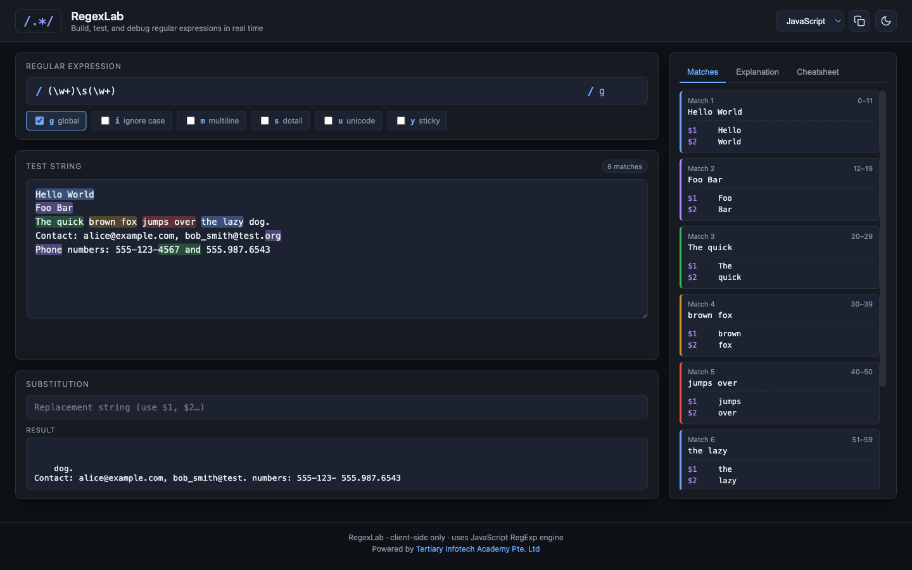

<div align="center">

# RegexLab

[](https://developer.mozilla.org/en-US/docs/Web/HTML)
[](https://developer.mozilla.org/en-US/docs/Web/CSS)
[](https://developer.mozilla.org/en-US/docs/Web/JavaScript)
[](https://alfredang.github.io/regexgenerator/)
[](https://opensource.org/licenses/MIT)

**A modern, client-side regex tester inspired by regex101.com — build, test, and debug regular expressions in real time.**

[Live Demo](https://alfredang.github.io/regexgenerator/) · [Report Bug](https://github.com/alfredang/regexgenerator/issues) · [Request Feature](https://github.com/alfredang/regexgenerator/issues)

</div>

## Screenshot



## About

RegexLab is a fast, fully client-side regular expression playground built with vanilla HTML, CSS, and JavaScript. There is no backend — your pattern and test data never leave the browser.

### Features

- **Live matching** with multi-color highlights overlaid on your test string
- **Flag toggles** for `g`, `i`, `m`, `s`, `u`, `y` synced with the flags input
- **Match inspector** showing index ranges, numbered capture groups, and named groups
- **Substitution panel** with `$1`, `$2`, … backreference support
- **Pattern explanation** that breaks the regex down token by token
- **Cheatsheet** for common metacharacters, quantifiers, and groups
- **Copy button** that copies the full `/pattern/flags` to clipboard
- **Dark / light theme** toggle (dark by default, preference persisted in `localStorage`)
- **Responsive layout** that collapses gracefully on small screens
- **Zero dependencies** — single HTML, CSS, and JS file

## Tech Stack

| Category   | Technology                                            |
| ---------- | ----------------------------------------------------- |
| Markup     | HTML5                                                 |
| Styling    | CSS3 (CSS variables, Grid, Flexbox)                   |
| Logic      | Vanilla JavaScript (ES2020+)                          |
| Regex      | Native `RegExp` engine in the browser                 |
| Storage    | `localStorage` (theme preference only)                |
| Deployment | GitHub Pages via GitHub Actions                       |

## Architecture

```
┌────────────────────────────────────────────────────────┐
│                       Browser                          │
│                                                        │
│  ┌──────────────┐  ┌────────────┐  ┌────────────────┐  │
│  │ Regex Input  │  │ Test Area  │  │  Substitution  │  │
│  └──────┬───────┘  └─────┬──────┘  └────────┬───────┘  │
│         │                │                   │         │
│         └────────────────┼───────────────────┘         │
│                          ▼                             │
│              ┌───────────────────────┐                 │
│              │  script.js (engine)   │                 │
│              │  - build RegExp       │                 │
│              │  - collect matches    │                 │
│              │  - render highlights  │                 │
│              │  - explain tokens     │                 │
│              └───────────┬───────────┘                 │
│                          ▼                             │
│        ┌──────────────────────────────────┐            │
│        │ Matches · Explanation · Cheats   │            │
│        └──────────────────────────────────┘            │
└────────────────────────────────────────────────────────┘
```

## Project Structure

```
regexgenerator/
├── index.html         # Markup + panel layout
├── styles.css         # Theme tokens, layout, components
├── script.js          # Regex engine, highlight, tabs, theme
├── screenshot.png     # README screenshot
└── .github/
    └── workflows/
        └── deploy.yml # GitHub Pages deploy workflow
```

## Getting Started

### Prerequisites

Any modern browser (Chrome, Firefox, Safari, Edge). No build step, no Node.js required.

### Run locally

Clone the repo and open `index.html` directly, or serve it with any static server:

```bash
git clone https://github.com/alfredang/regexgenerator.git
cd regexgenerator

# Option 1 — open directly
open index.html

# Option 2 — serve with Python
python3 -m http.server 8000
# then visit http://localhost:8000
```

## Deployment

This project deploys automatically to **GitHub Pages** on every push to `main` via the workflow at `.github/workflows/deploy.yml`.

To deploy your own fork:

1. Fork the repository
2. Go to **Settings → Pages** and set **Source** to **GitHub Actions**
3. Push to `main` — the site will be live at `https://<your-user>.github.io/regexgenerator/`

You can also host the three files (`index.html`, `styles.css`, `script.js`) on any static host: Vercel, Netlify, Cloudflare Pages, or an S3 bucket.

## Contributing

Contributions are welcome.

1. Fork the project
2. Create a feature branch: `git checkout -b feat/my-feature`
3. Commit your changes: `git commit -m "feat: add my feature"`
4. Push to the branch: `git push origin feat/my-feature`
5. Open a Pull Request

For ideas, questions, or bug reports, please open an [issue](https://github.com/alfredang/regexgenerator/issues).

## Developed By

**Tertiary Infotech Academy Pte. Ltd.** — [tertiarycourses.com.sg](https://www.tertiarycourses.com.sg/)

## Acknowledgements

- Inspired by [regex101.com](https://regex101.com/)
- Icons inlined from [Feather Icons](https://feathericons.com/)
- Built with the native [JavaScript `RegExp`](https://developer.mozilla.org/en-US/docs/Web/JavaScript/Reference/Global_Objects/RegExp) engine

---

<div align="center">

If this project was useful to you, please consider giving it a ⭐ on GitHub.

</div>
